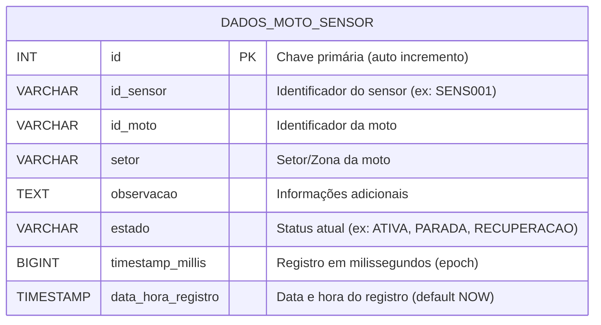
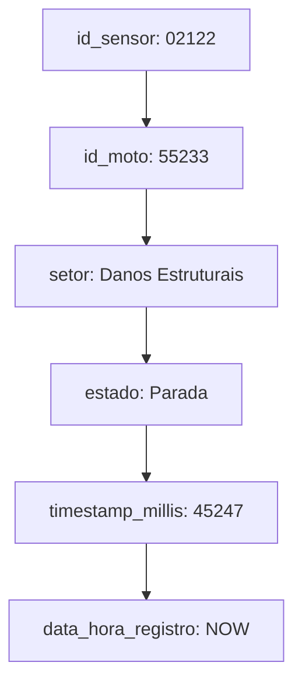
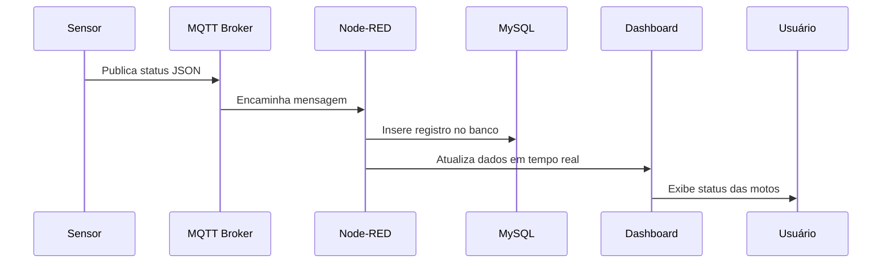
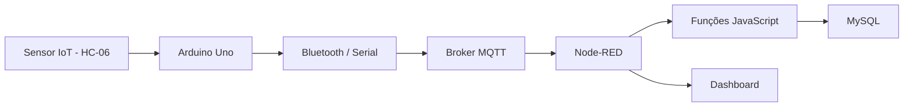
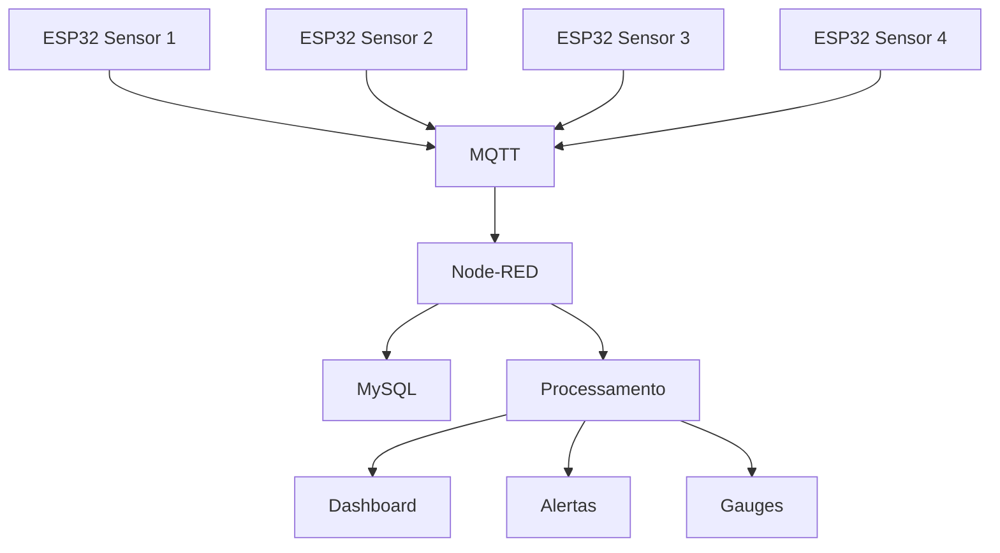

# Mottu Mottion – Rastreamento de Motos com IoT, Node-RED e MySQL


O Mottu Mottion é um sistema de rastreamento e gestão de motos desenvolvido para otimizar a operação da empresa de aluguel de motos Mottu. O projeto integra IoT, Node-RED e MySQL, oferecendo uma solução completa para monitoramento e controle da frota em tempo real nos pátios da Mottu.

A aplicação permite acompanhar a movimentação das motos entre os setores dos pátios, utilizando sensores Bluetooth e GPS embarcados em microcontroladores ESP32. Cada movimentação é registrada automaticamente, garantindo:

Rastreabilidade total das motos em tempo real.

Atualização instantânea da quantidade de veículos por setor.

Gestão eficiente de clientes, funcionários, pátios e vagas.

Controle visual de status por meio de dashboards Node-RED com gauges, contadores e indicadores de cores.

Em resumo, o Mottu Mottion fornece às equipes de gestão e operação logística uma visão completa da frota, melhora a eficiência operacional, aumenta a segurança e apoia a tomada de decisão baseada em dados em tempo real.

---

## Etiquetas

[](https://choosealicense.com/licenses/mit/)
[](https://nodered.org/)
[](https://www.mysql.com/)
[](https://www.espressif.com/en/products/socs/esp32)

---

## Demonstração

* Vídeo: [Link do vídeo](#)
* Simuladores Wokwi:

  * [Sensor 1](https://wokwi.com/projects/446531558567289857)
  * [Sensor 2](https://wokwi.com/projects/446531553727060993)
  * [Sensor 3](https://wokwi.com/projects/446531543184675841)
  * [Sensor 4](https://wokwi.com/projects/446531548506200065)

---

## Funcionalidades

Alertas Inteligentes: Notificações em UI Toast sobre motos em setores críticos (Danos Estruturais, Manutenção) e detecção de anomalias (Múltiplas Motos / Mesmo Sensor).

Interface Web Profissional: Dashboard (customizado via ui_template) com CSS moderno, cards de status e tabela de localização geral.

Gauges de Capacidade: Indicadores visuais para monitorar o volume de motos em cada setor (ex: "Agendada para manutenção"), permitindo uma gestão visual de gargalos.

Controle de LEDs (Feedback Físico): Capacidade de receber comandos para acender LEDs no pátio, indicando o status do setor, melhorando a comunicação visual para os funcionários.

---

## Instalação e Execução (Node-RED)

Os comandos genéricos de `npm` sugerem que o Node-RED está sendo executado localmente. Para um ambiente Node-RED, as etapas são mais específicas:

### Pré-requisitos

1.  Node.js e Node-RED instalados (local ou em Docker).
2.  Servidor MySQL em execução.
3.  Nós do Node-RED instalados: `node-red-contrib-mysql` e `node-red-dashboard`.

### Setup do Banco de Dados

Execute o script SQL para criar o banco de dados e a tabela `dados_moto_sensor`:

```sql
CREATE DATABASE IF NOT EXISTS sensor_table;
USE sensor_table;
-- ... (restante do CREATE TABLE)
```

### Importação do Fluxo

1.  Abra a interface do Node-RED.
2.  Clique no menu (hambúrguer) \> **Importar**.
3.  Cole o conteúdo do arquivo **`flow.json`** no campo de texto e clique em Importar.
4.  Configure o nó **`MySQL DB`** (`id: 1857ae14076cf7e9`) com as credenciais corretas do seu servidor MySQL (Host, Porta, Usuário, Senha e o nome do DB: `sensor_table`).
5.  Clique em **Deploy** no canto superior direito para iniciar o fluxo.


## Arquitetura do Sistema

### 1. IoT / Firmware ESP32

* Detecta movimentações e mudanças de setor.
* Publica dados JSON no broker MQTT:

**Broker:** `broker.hivemq.com`
**Tópico:** `iot/mottu-mottion/status`

```json
{
  "id_sensor": "01111",
  "id_moto": "45124",
  "setor": "Agendada para manutenção",
  "timestamp": 37525,
  "estado": "Parada"
}
```

Esses dados são decodificados e enviados para os próximos nós do fluxo.


## Estrutura do Banco de Dados



**Função**: armazenar todos os registros publicados pelos sensores das motos, permitindo auditoria, relatórios e acompanhamento histórico.

---

### Exemplo de Registro (Graph Chart)



---

### Fluxo de Atualização do Dashboard



---

## **Arquitetura IoT Completa (Teórica)**


## **Arquitetura Real Implementada (Prática)**


---

* Recebe comandos de alteração de LEDs via MQTT.
* LEDs coloridos indicam status de cada moto por setor.

| Cor LED      | Setor Correspondente     |
| ------------ | ------------------------ |
| Vermelho     | Danos Estruturais        |
| Azul         | Reparos Simples          |
| Verde Claro  | Minha Mottu              |
| Verde Escuro | Pronta para Aluguel      |
| Amarelo      | Pendência                |
| Cinza        | Agendada para manutenção |
| Roxo         | Sem Placa                |
| Bordô        | Motor com defeito        |

---

## Por que Node-RED

O **Node-RED** é uma ferramenta de **programação visual para IoT**, criada pela IBM, que permite integrar dispositivos, APIs e bancos de dados em fluxos lógicos.
Ele foi escolhido por unir **simplicidade, flexibilidade e poder de integração** — ideal para sistemas de monitoramento em tempo real.

No projeto **Mottu Mottion**, o Node-RED atua como o **cérebro da aplicação**, sendo responsável por:

* Receber dados MQTT dos sensores ESP32;
* Processar e armazenar informações no MySQL;
* Atualizar dashboards em tempo real;
* Enviar notificações e comandos automáticos aos dispositivos.

**Vantagens:**

* Comunicação em tempo real via MQTT
* Dashboards integrados e personalizáveis
* Programação visual + lógica em JavaScript
* Fácil integração com bancos e APIs

Em resumo, o Node-RED foi escolhido por oferecer uma **plataforma completa e leve** para conectar, processar e visualizar dados IoT em tempo real.


### 2. Node-RED

* Recebe dados via MQTT, processa com `Function nodes` e atualiza dashboards.
* Insere registros no MySQL apenas se houver mudança de setor.
* Atualização instantânea de gauges, contadores e status de LEDs.

---

### 3. MySQL

* Armazena histórico completo e evita duplicidade de registros.
* Permite análises futuras de movimentação e performance de setores.

---

---

## Instalação e Deploy

```bash
git clone https://link-para-o-projeto
cd my-project
npm install
npm run start
```

Para deploy:

```bash
npm run deploy
```

---

## Integração com Outras Disciplinas

O projeto **Mottu Mottion** não foi apenas uma solução técnica de IoT, Node-RED e MySQL, mas também uma oportunidade de integrar conceitos e práticas de várias disciplinas do curso, tornando o sistema mais completo e profissional.

### 1. API (Application Programming Interface)

| Integração                   | Como o Código Funciona                                                                                                                                            | Próximos Passos                                                                                             |
| ---------------------------- | ----------------------------------------------------------------------------------------------------------------------------------------------------------------- | ----------------------------------------------------------------------------------------------------------- |
| API de Ingestão de Dados     | A função espera a chegada de dados de cada moto (`msg.payload`) via MQTT Input ou HTTP Input. Esta entrada atua como API para receber dados dos dispositivos IoT. | Implementar endpoints REST ou WebSocket para integração futura com apps externos.                           |
| API de Consulta (Middleware) | O Node-RED armazena e processa o estado do dashboard (`flow.set("dashboard", estado)`), funcionando como uma API interna.                                         | Disponibilizar o estado consolidado via HTTP Response ou WebSocket para apps mobile ou dashboards externos. |

### 2. Banco de Dados

| Integração          | Como o Código Funciona                                                                                   | Próximos Passos                                                                                               |
| ------------------- | -------------------------------------------------------------------------------------------------------- | ------------------------------------------------------------------------------------------------------------- |
| Estado em Memória   | O Node-RED utiliza `flow.set()` e `flow.get()` para manter o estado persistente temporário do dashboard. | Para persistência de longo prazo, integrar com MySQL ou outros bancos relacionais/NoSQL.                      |
| Histórico e Análise | O array `estado.historico` armazena os últimos 100 eventos.                                              | Armazenar dados críticos em banco relacional ou de séries temporais (como InfluxDB) para análises históricas. |

### 3. Aplicação Web e Mobile

| Integração    | Como o Código Funciona                                                                 | Próximos Passos                                                                      |
| ------------- | -------------------------------------------------------------------------------------- | ------------------------------------------------------------------------------------ |
| Web Dashboard | O `ui_template` consome a saída da função e exibe métricas e contadores em tempo real. | Atender necessidade de monitoramento via web.                                        |
| App Mobile    | O objeto `estado` gerado pelo Node-RED funciona como "fonte da verdade" do sistema.    | Desenvolver app mobile (React Native, Flutter) consumindo a API de consulta em JSON. |

### 4. DevOps (Development and Operations)

| Integração               | Como o Código Funciona                                                            | Próximos Passos                                                                               |
| ------------------------ | --------------------------------------------------------------------------------- | --------------------------------------------------------------------------------------------- |
| Código e Versionamento   | Os fluxos Node-RED e códigos JavaScript são criados diretamente na interface web. | Armazenar arquivos `.json` do fluxo em Git/GitHub para versionamento, colaboração e rollback. |
| Implantação (Deployment) | Deploy é feito diretamente pelo botão "Deploy" do Node-RED.                       | Rodar Node-RED em container Docker para CI/CD e ambientes de produção padronizados.           |
| Monitoramento            | Uso de `node.warn()` permite depuração e alerta em tempo real.                    | Integrar logs e alertas em ferramentas centralizadas (Prometheus/Grafana ou ELK Stack).       |


## Aprendizados

* Integração IoT + Node-RED + MySQL sem APIs intermediárias.
* Controle de estado e dashboards em tempo real.
* Modularidade para escalabilidade em múltiplas filiais.
* Persistência de histórico de eventos críticos.

---

## Benefícios do Fluxo

* Comunicação em tempo real com os sensores das motos
* Registro completo em banco de dados SQL
* Dashboard interativo no Node-RED
* Alertas automáticos por setor
* Base sólida para analytics e relatórios de manutenção

---

## Autores

* Giovanna Revito Roz – RM558981
* Kaian Gustavo de Oliveira Nascimento – RM558986
* Lucas Kenji Kikuchi – RM554424

---

## Referências

* [Awesome README Templates](https://awesomeopensource.com/project/elangosundar/awesome-README-templates)
* [Awesome README](https://github.com/matiassingers/awesome-readme)
* [How to Write a Good README](https://bulldogjob.com/news/449-how-to-write-a-good-readme-for-your-github-project)

---
