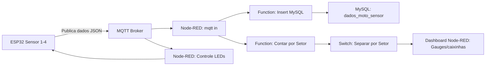

# Mottu Mottion – Rastreamento de Motos com IoT, Node-RED e MySQL

**Projeto de rastreamento e gestão de motos em pátios da Mottu utilizando 4 sensores ESP32, Node-RED e MySQL.**

---

## 1. Descrição

O **Mottu Mottion** resolve o problema de **falta de rastreabilidade e padronização** nos pátios da Mottu, garantindo:

* Localização rápida de motos;
* Registro de manutenções e reparos;
* Redução de riscos de extravios ou movimentações indevidas.

O sistema utiliza:

* 4 sensores ESP32 simulando motos diferentes;
* Comunicação via MQTT;
* LEDs para indicar status;
* Dashboards em Node-RED com gauges estilo “caixinhas” (similar ao Grafana);
* Armazenamento no MySQL com inserção condicional (apenas quando há mudança de setor).

---

## 2. Arquitetura do Sistema

O sistema possui **três camadas principais**:

```
[ ESP32 / Sensores ]  →  [ MQTT Broker ]  →  [ Node-RED ]  →  [ MySQL ]  →  [ Dashboard ]
```

**Descrição detalhada do fluxo:**

1. **ESP32 / Sensores IoT:**

   * Cada sensor monitora uma moto e publica dados JSON via MQTT ao detectar movimento ou mudança de setor.
   * LEDs indicam status do veículo por cor.

2. **MQTT Broker:**

   * Recebe e retransmite mensagens para Node-RED e para controle de LEDs.
   * Permite comunicação bidirecional.

3. **Node-RED:**

   * Nó `mqtt in` recebe dados;
   * `Function Insert MySQL` compara setor atual x setor anterior;

     * Se mudou → insere no MySQL;
     * Se não mudou → não insere, evitando duplicidade;
   * `Function Contar por Setor` calcula quantas motos estão em cada setor;
   * `Switch Separar por Setor` envia dados para gauges no Dashboard.

4. **MySQL:**

   * Tabela principal: `dados_moto_sensor`;
   * Armazena histórico de movimentações, permitindo consultas e relatórios.

5. **Dashboard Node-RED:**

   * Gauges estilo caixinhas/Grafana mostram quantidade de motos por setor;
   * Atualização em tempo real.

---

## 3. Fluxo de Dados – Diagrama Visual



**Explicação do diagrama:**

* **ESP32:** detecta movimentação ou mudança de setor.
* **MQTT Broker:** distribui a mensagem para Node-RED e permite controle de LEDs.
* **Node-RED:** processa dados, decide se insere no banco, atualiza contadores por setor e envia para dashboards.
* **MySQL:** armazena histórico de movimentações apenas se houver alteração real de setor.
* **Dashboard:** visualização clara e intuitiva em tempo real, estilo Grafana.

---

## 4. Banco de Dados

**Tabela principal `dados_moto_sensor`:**

```sql
CREATE TABLE dados_moto_sensor (
    id INT AUTO_INCREMENT PRIMARY KEY,
    id_sensor VARCHAR(255),
    id_moto VARCHAR(255),
    setor VARCHAR(255),
    observacao TEXT,
    timestamp_millis BIGINT,
    data_hora_registro TIMESTAMP DEFAULT CURRENT_TIMESTAMP
);
```

**Obs:** A inserção condicional evita múltiplos registros iguais e mantém histórico limpo.

---

## 5. LEDs de Status

| Cor LED      | Setor Correspondente     |
| ------------ | ------------------------ |
| Vermelho     | Danos Estruturais        |
| Azul         | Reparos Simples          |
| Verde Claro  | Minha Mottu              |
| Verde Escuro | Pronta para Aluguel      |
| Amarelo      | Pendência                |
| Cinza        | Agendada para manutenção |
| Roxo         | Sem Placa                |
| Bordô        | Motor com defeito        |

---

## 6. Dashboard Node-RED

* Gauges estilo caixinhas/Grafana;
* Contagem de motos por setor em tempo real;
* Filtro por status e setor;
* Atualização automática via MQTT;
* Evita sobrecarga de dados ao registrar somente mudanças de setor.

---

## 7. Ferramentas

* **Hardware:** ESP32, LEDs, sensores Wokwi;
* **Software:** Node-RED, Arduino IDE, Java + Spring Boot, MySQL, MQTT HiveMQ;
* **Simuladores Wokwi:**

  * Sensor 1: [Link](https://wokwi.com/projects/442719596591605761)
  * Sensor 2: [Link](https://wokwi.com/projects/442741085348602881)
  * Sensor 3: [Link](https://wokwi.com/projects/442741385511878657)
  * Sensor 4: [Link](https://wokwi.com/projects/442741436895251457)

---

## 8. Diferenciais

* Uso de **4 sensores ESP32** simulando motos distintas;
* **Inserção condicional**: evita duplicidade de dados;
* **Gauges estilo Grafana** para visualização intuitiva;
* Atualizações em tempo real via MQTT;
* Modularidade e escalabilidade para múltiplas filiais;
* Histórico completo de movimentações.

---

## 9. Conclusão

O **Mottu Mottion** permite:

* Monitoramento de motos em tempo real;
* Rastreabilidade e segurança;
* Dashboard intuitivo estilo Grafana;
* Evita duplicidade de dados, mantendo histórico limpo;
* Escalabilidade e modularidade para toda a frota.

---

## 10. Roadmap Futuro

* Integração com app mobile para clientes e funcionários;
* Dashboards em Node-RED + Grafana com relatórios automáticos;
* Exportação de relatórios em PDF/Excel;
* Expansão para IoT em escala nacional.

---

## 11. Authors

* Giovanna Revito Roz – RM558981
* Kaian Gustavo de Oliveira Nascimento – RM558986
* Lucas Kenji Kikuchi – RM554424

---

Se você quiser, posso criar **uma versão ainda mais visual com imagens do Node-RED real, setas mostrando o fluxo MQTT e gauges animadas**, como se fosse um manual passo a passo do sistema.

Quer que eu faça essa versão completa visual também?
