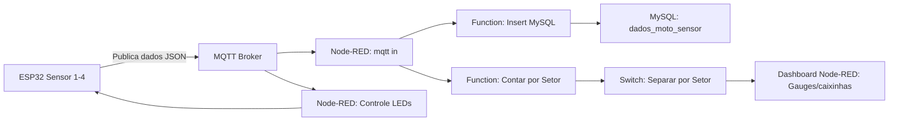
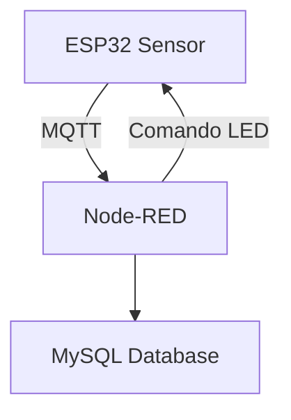
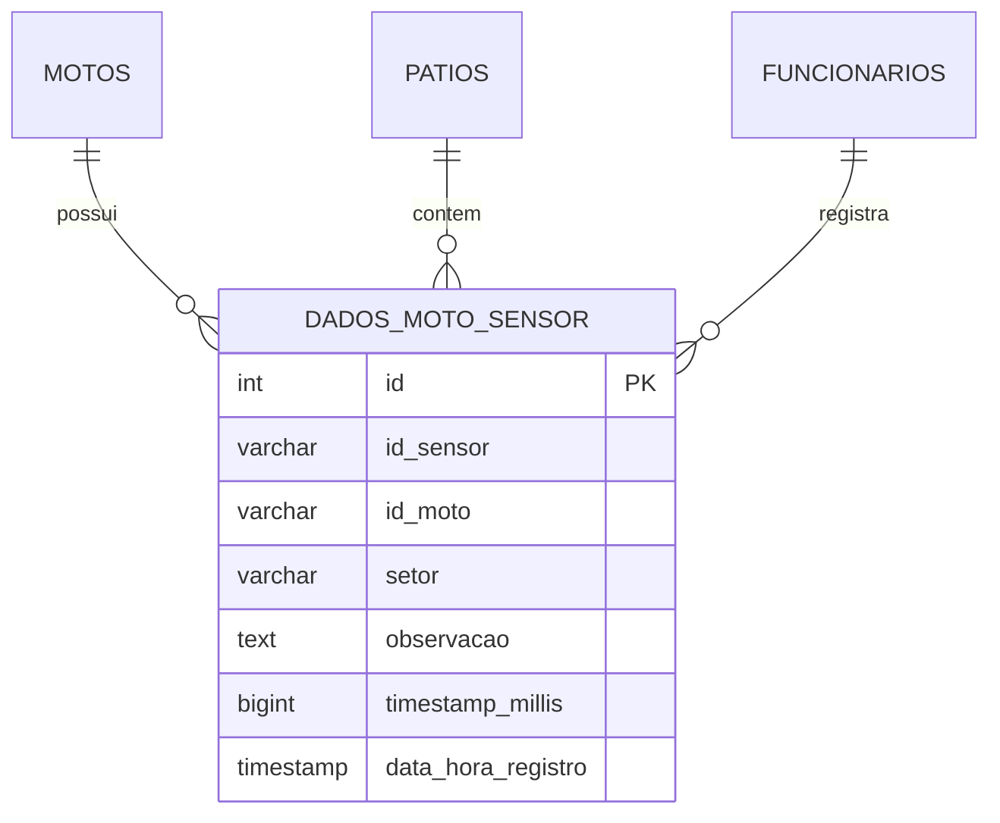
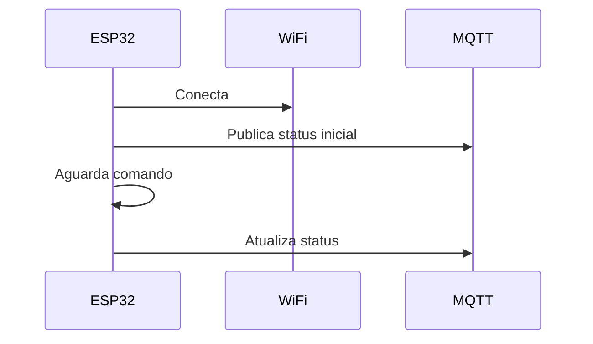

# Mottu Mottion – Rastreamento de Motos com IoT, Node-RED e MySQL

**Projeto de rastreamento e gestão de motos em pátios da Mottu utilizando IoT, Node-RED e MySQL.**

---

## 1. Descrição

O **Mottu Mottion** surge como uma solução tecnológica para os desafios enfrentados pela **Mottu** na gestão física de seus pátios de motos. Com mais de 100 filiais pelo Brasil, cada unidade possui layouts distintos e fluxos operacionais próprios.

O problema central detectado é a **falta de rastreabilidade e padronização**, resultando em:

* Dificuldade em localizar motos rapidamente;
* Falta de registro preciso de manutenções e reparos;
* Riscos de extravios, furtos ou movimentação indevida de veículos.

O Mottu Mottion digitaliza e automatiza o controle de motos com:

* Sensores ESP32 conectados por Wi-Fi;
* Comunicação via MQTT;
* Controle de status por LEDs coloridos;
* Dashboards em Node-RED;
* Armazenamento direto em MySQL.

---

## 2. Imagens do Projeto

  
  
  
  
  
  
  
  
  
  

---

## 3. Objetivos

* Automatizar o controle de motos no pátio;
* Padronizar processos entre todas as filiais;
* Monitorar setores em tempo real;
* Armazenar histórico de movimentações para análise;
* Disponibilizar interface visual intuitiva via dashboards Node-RED.

## 3. Fluxo de Dados – Diagrama Visual



**Explicação do diagrama:**

* **ESP32:** detecta movimentação ou mudança de setor.
* **MQTT Broker:** distribui a mensagem para Node-RED e permite controle de LEDs.
* **Node-RED:** processa dados, decide se insere no banco, atualiza contadores por setor e envia para dashboards.
* **MySQL:** armazena histórico de movimentações apenas se houver alteração real de setor.
* **Dashboard:** visualização clara e intuitiva em tempo real, estilo Grafana.

---

**Descrição detalhada do fluxo:**

1. **ESP32 / Sensores IoT:**

   * Cada sensor monitora uma moto e publica dados JSON via MQTT ao detectar movimento ou mudança de setor.
   * LEDs indicam status do veículo por cor.

2. **MQTT Broker:**

   * Recebe e retransmite mensagens para Node-RED e para controle de LEDs.
   * Permite comunicação bidirecional.

3. **Node-RED:**

   * Nó `mqtt in` recebe dados;
   * `Function Insert MySQL` compara setor atual x setor anterior;

     * Se mudou → insere no MySQL;
     * Se não mudou → não insere, evitando duplicidade;
   * `Function Contar por Setor` calcula quantas motos estão em cada setor;
   * `Switch Separar por Setor` envia dados para gauges no Dashboard.

4. **MySQL:**

   * Tabela principal: `dados_moto_sensor`;
   * Armazena histórico de movimentações, permitindo consultas e relatórios.

5. **Dashboard Node-RED:**

   * Gauges estilo caixinhas/Grafana mostram quantidade de motos por setor;
   * Atualização em tempo real.

---

## 4. Arquitetura do Sistema

### 4.1 Camadas



> **⚠️ Importante: Este projeto NÃO utiliza API (REST) entre o Node-RED e o banco de dados.**

O uso de uma API foi **dispensado propositalmente** devido à eficiência do fluxo direto entre os componentes. Veja os motivos abaixo:

* **Baixa latência**: O **Node-RED se conecta diretamente** ao broker MQTT e ao banco de dados **MySQL**, eliminando camadas intermediárias.
* **Simplicidade arquitetural**: Menos componentes envolvidos significa **menos pontos de falha** e manutenção mais simples.
* **Gravação direta no banco**: O Node-RED **grava os dados diretamente no MySQL**, mas **somente após verificar** se houve **mudança real no setor da moto**, evitando registros duplicados.
* **Atualização em tempo real**: Os **dashboards são atualizados instantaneamente**, aproveitando a arquitetura de **publicação/assinatura do MQTT**.
* **Fluxos visuais e eficientes**: Toda a lógica (como validações e contagens) é feita com **Function nodes no Node-RED**, **sem necessidade de backend externo** como Java, Spring Boot ou Node.js.


1. **Hardware/IoT**

   * Sensores ESP32 por setor;
   * LEDs indicadores de status;
   * Comunicação via Wi-Fi e MQTT.

2. **Banco de Dados (MySQL)**

   * Registra movimentações, motos, setores, funcionários e clientes;
   * Tabelas principais: `dados_moto_sensor`, `motos`, `patios`, `usuarios`, `funcionarios`, `vagas`.

3. **Interface Node-RED**

   * Recebe dados via MQTT;
   * Salva diretamente no MySQL;
   * Atualiza dashboards em tempo real (gauges, contadores e filtros por setor/status).

---

### 4.2 Comunicação IoT

Cada setor possui Wi-Fi dedicado, e cada sensor ESP32 monitora o setor correspondente, garantindo:

* Operação isolada por setor;
* Redundância e resiliência;
* Modularidade e escalabilidade.

**Fluxo do sensor:**

1. Detecta status ou movimentação da moto;
2. Publica dados JSON no broker MQTT:

```json
{
  "id_sensor": "01111",
  "id_moto": "45124",
  "setor": "Agendada para manutenção",
  "timestamp": 123456789
}
```

3. Node-RED recebe, verifica mudanças e:

   * Salva diretamente no MySQL;
   * Atualiza dashboards em tempo real.

4. Cada alteração de LED/status é publicada de volta via MQTT.

---

### 4.3 Comunicação MQTT

* Broker: `broker.hivemq.com`
* Tópico de publicação: `iot/mottu-mottion/status`
* Tópico de assinatura (controle LEDs): `iot/mottu-mottion/comandos`
* Protocolo: MQTT sobre TCP (porta 1883)

**Benefícios:** comunicação bidirecional, baixo consumo de banda e suporte a múltiplos sensores/dashboards.

---

### 4.4 Node-RED + MySQL sem API

1. Sensor ESP32 envia dados via MQTT;
2. Node-RED processa os dados com Function nodes;
3. Insere ou atualiza registros no MySQL usando MySQL node;
4. Dashboards atualizados em tempo real.

**Vantagens:** menor latência, simplicidade e histórico completo de movimentações.

---

### 4.5 Estrutura de Banco de Dados



Outras tabelas: `motos`, `patios`, `funcionarios`, `vagas`.

---

## 5. Firmware ESP32

* Desenvolvido em **Arduino C++**, integrando Wi-Fi, MQTT e LEDs;
* Publica status em intervalos configuráveis (ex.: 5 segundos);
* Recebe comandos de alteração de LEDs/setores via MQTT;
* Código modular para inclusão de novos sensores/setores.

**LEDs configuráveis por setor:**

| Cor LED      | Setor Correspondente     |
| ------------ | ------------------------ |
| Vermelho     | Danos Estruturais        |
| Azul         | Reparos Simples          |
| Verde Claro  | Minha Mottu              |
| Verde Escuro | Pronta para Aluguel      |
| Amarelo      | Pendência                |
| Cinza        | Agendada para manutenção |
| Roxo         | Sem Placa                |
| Bordô        | Motor com defeito        |

---

### Fluxo do ESP32



---

## 6. Dashboard Node-RED

* Dashboard responsivo com gauges por setor;
* Filtragem por setor, status e data;
* Atualização em tempo real via MQTT;
* Envio de comandos para alteração de LEDs.

> Não é necessário utilizar API intermediária para registro de movimentações.

---

## 7. Diferenciais

* Modularidade e escalabilidade;
* Atualizações em tempo real via MQTT;
* Padronização entre filiais;
* Rastreabilidade completa da frota;
* Integração total: IoT + Node-RED + MySQL.

---

## 8. Ferramentas Utilizadas

* **Hardware:** ESP32, LEDs, sensores simulados via Wokwi
* **Software:** Node-RED, Arduino IDE, Java + Spring Boot, MySQL, MQTT Broker HiveMQ
* **Simuladores Wokwi:**

  * Sensor 1: [Link](https://wokwi.com/projects/442719596591605761)
  * Sensor 2: [Link](https://wokwi.com/projects/442741085348602881)
  * Sensor 3: [Link](https://wokwi.com/projects/442741385511878657)
  * Sensor 4: [Link](https://wokwi.com/projects/442741436895251457)

---

## 9. Conclusão

O **Mottu Mottion** oferece:

* Gestão eficiente e automatizada da frota;
* Rastreabilidade e segurança em tempo real;
* Dashboards intuitivos e atualizações automáticas;
* Histórico de movimentações para análise e otimização de processos.

---

## 10. Roadmap Futuro

* Integração com aplicação mobile para clientes e funcionários;
* Dashboard em tempo real com Node-RED e Grafana;
* Relatórios em PDF e Excel;
* Expansão para monitoramento via IoT em escala.

---

## 11. Authors

* Giovanna Revito Roz – RM558981
* Kaian Gustavo de Oliveira Nascimento – RM558986
* Lucas Kenji Kikuchi – RM554424

---

